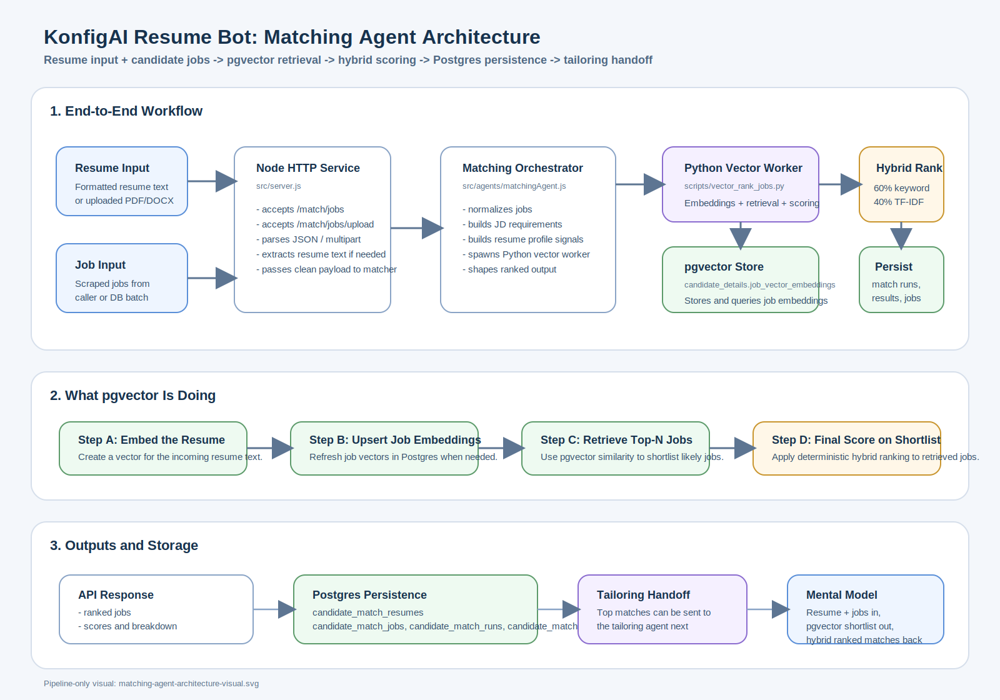
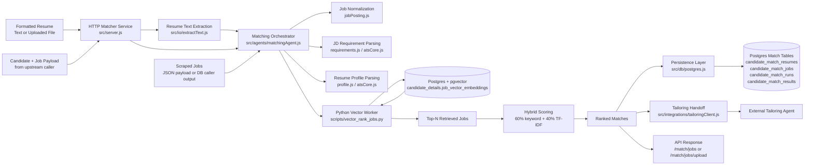
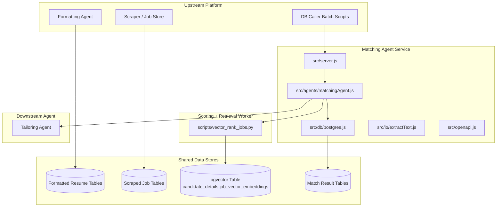
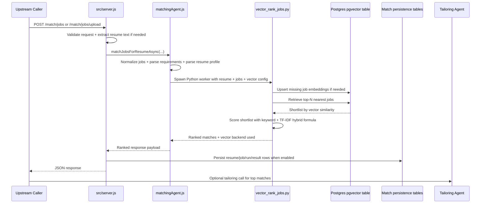

# Matching Agent Architecture

This document is the simplest visual explanation of Vishal's matching-agent workflow in this repo.

It covers:
- where inputs come from
- how the matcher retrieves and ranks jobs
- where pgvector fits
- what gets persisted
- where tailoring plugs in

## 1. Whole Flow

## 2. Runtime Architecture

## 3. Sequence: One Match Request

## 4. What Each Layer Is Responsible For

- `src/server.js`
  Handles HTTP requests, file uploads, multipart parsing, JSON parsing, request validation, and final response/persistence wiring.

- `src/agents/matchingAgent.js`
  Main orchestrator. It normalizes incoming jobs, builds job requirements and resume profile signals, calls the Python worker, and shapes the ranked output.

- `scripts/vector_rank_jobs.py`
  Retrieval + scoring worker. This is where pgvector is used and where the shortlist scoring happens.

- `src/db/postgres.js`
  Persistence layer for:
  - `candidate_match_resumes`
  - `candidate_match_jobs`
  - `candidate_match_runs`
  - `candidate_match_results`

- `src/integrations/tailoringClient.js`
  Downstream connector for the tailoring stage after matching.

## 5. Where pgvector Fits

pgvector is not the final scorer. It is the retrieval engine.

The worker flow is:
1. embed the resume
2. embed or refresh candidate job vectors
3. store vectors in `candidate_details.job_vector_embeddings`
4. retrieve the closest jobs with pgvector similarity
5. run final ranking on the shortlist

That final ranking is:
- `60%` keyword overlap
- `40%` TF-IDF cosine similarity

So the architecture is:

`pgvector retrieval -> shortlist -> deterministic hybrid scoring -> ranked matches`

## 6. Current Tables Involved

### Retrieval table
- `candidate_details.job_vector_embeddings`

### Persistence tables
- `candidate_details.candidate_match_resumes`
- `candidate_details.candidate_match_jobs`
- `candidate_details.candidate_match_runs`
- `candidate_details.candidate_match_results`

## 7. Inputs and Outputs

### Inputs
- formatted resume text
- uploaded PDF/DOCX resume converted to text
- scraped job postings
- optional upstream IDs like `resumeId`, `matchRunId`, `candidateName`

### Outputs
- ranked jobs
- scores and scoring breakdown
- persistence metadata
- optional tailoring handoff inputs

## 8. Mental Model

If someone asks "what does Vishal's matching agent do?", the shortest accurate answer is:

> It takes one formatted resume plus a candidate set of jobs, uses pgvector to retrieve the most relevant jobs, scores that shortlist with a deterministic hybrid matcher, persists the results to Postgres, and optionally hands the top matches to the tailoring agent.
